<h1 align="center" >
  
  
</h1>

<p align="center">Leve felicidade para o mundo, visite orfanatos e mude o dia de muitas crianças. NLW#3</p>

<h4 align="center"> 
	🚧  ReadMe em construção...  🚧
</h4>

<p align="center">
 <a href="#-sobre">Sobre</a> •
 <a href="#-layout">Layout</a> • 
 <a href="#-executando-o-happy">Como executar</a> • 
 <a href="#-tecnologias">Tecnologias</a> • 
 <a href="#-autora">Autora</a> 
</p>

---

## 💡 Sobre

Essa aplicação permite que, se você faz parte de um orfanato, cadastre ele no mapa e caso você queira visitar um orfanato e fazer o dia de muitas crianças mais feliz, este é o lugar que vai encontrar os orfanatos mais perto de você, na cidade do Rio de Janeiro.

Este projeto foi construído durante a terceira edição do evento Next Level Week da [Rocketseat](https://rocketseat.com.br/).

---

## 🎨 Layout


### Web

<p align="center">
                                Landing
  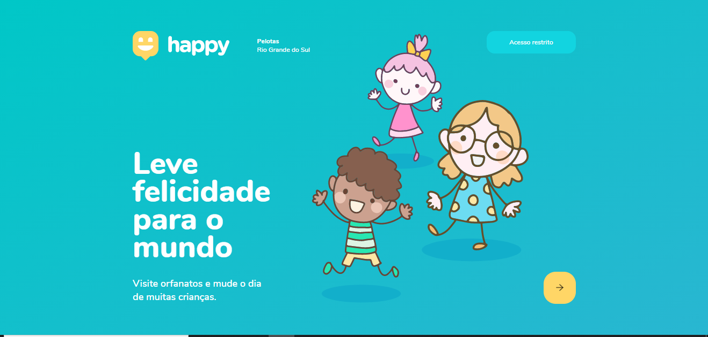
                                Map Page
  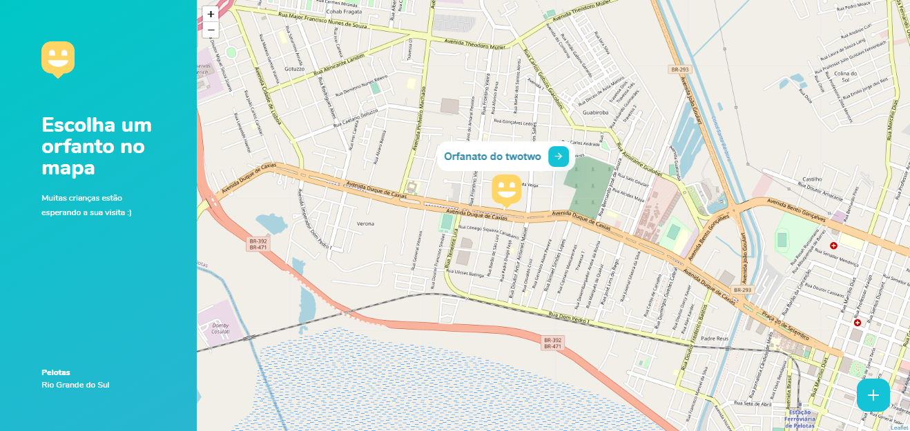
                                Criação de orfanatos
  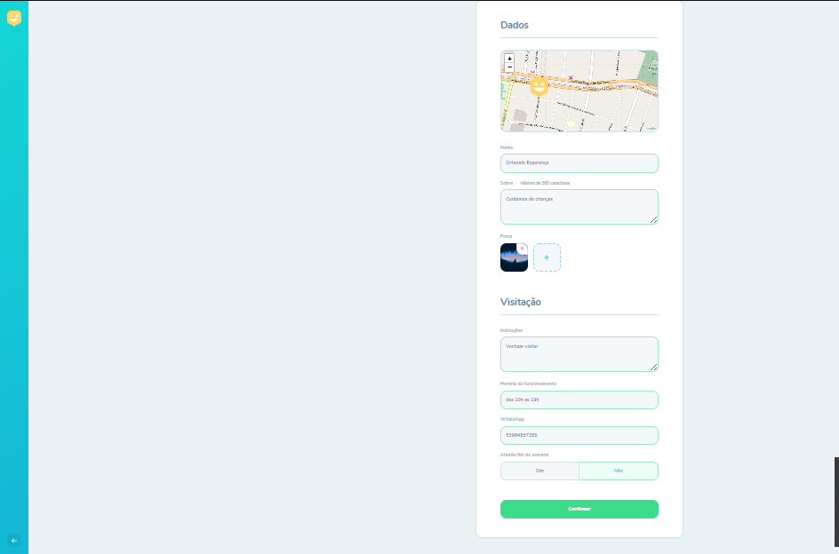
                                Tela de confirmação
  
                                Tela de login
  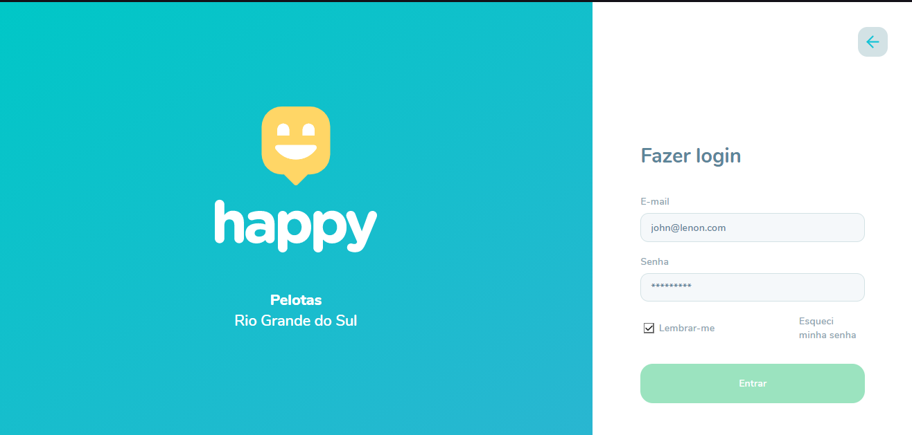
                                Painel de admin
  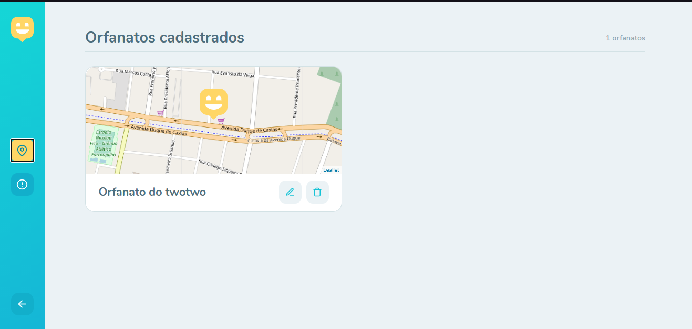
                                Painel de admin
  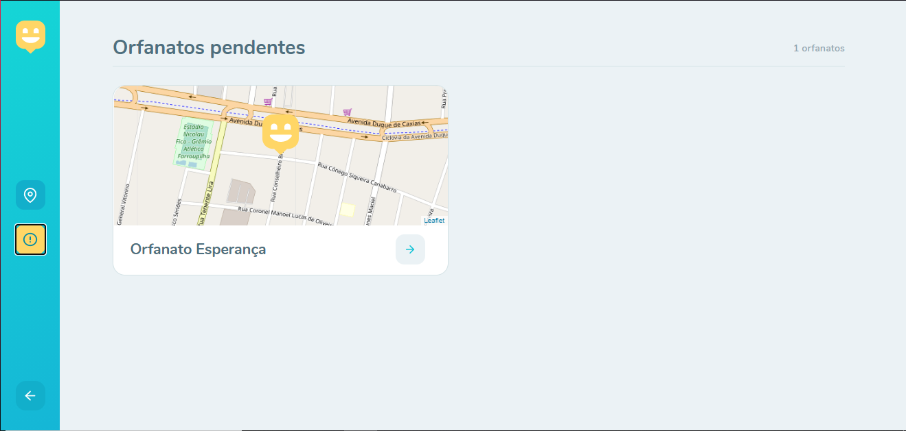
</p>
<br>


## 👌 Funcionalidades


* Dashboard visual e interativa para receber o usuário
*  Login
   *  Usuarios administradores possuem cedenciais para acessar o painel de administrador 
   * Usuarios administradores podem deletar, editar e aprovar orfanatos cadastrados
   * Usuarios administradores podem recuperar sua senha de login através do email
* Pagina com mapa de orfanatos para o usuario acessar a localidade e detalhes dos orfanatos
    *  Usuarios também podem entrar em contato via whatsapp diretamente com o orfanato
<br>
---

### Mobile
<p align="center">
                               
  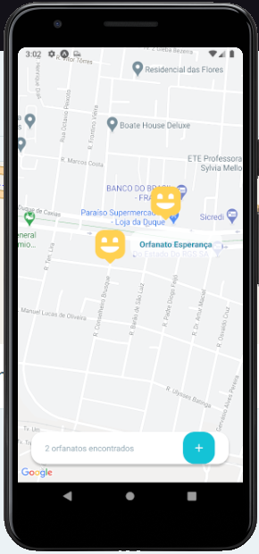
                                
  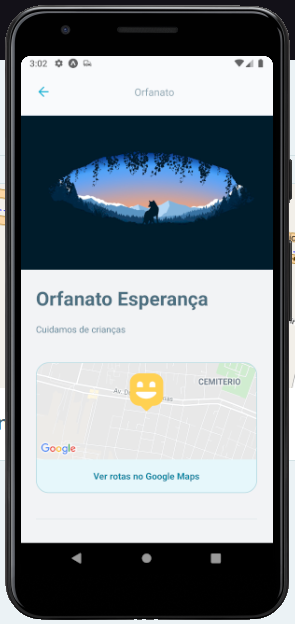
                               
  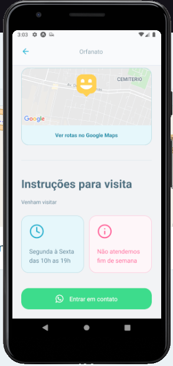
   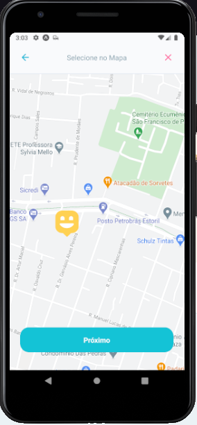
    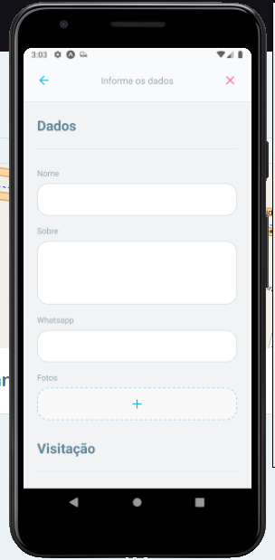
     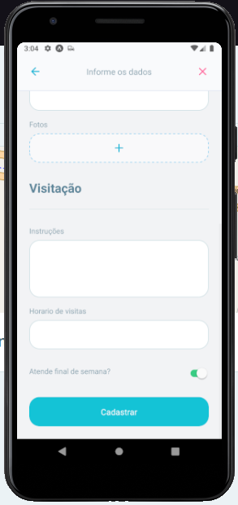
</p>
---

## 👌 Funcionalidades

* Pagina com mapa de orfanatos para o usuario acessar a localidade e detalhes dos orfanatos
* Usuarios podem criar novos orfanatos informando os campos necessários
*  Usuarios também podem entrar em contato via whatsapp diretamente com o orfanato
---
## 💻 Executando o Happy

### Pré-requisitos

É necessário ter instalado na sua máquina para execução desse projeto:
- NodeJS
- Gerenciador de pacotes (Npm ou Yarn) 
- Banco de dados postgreSQL(Local ou através de docker)
  - caso opte por instalar o docker este é um tutorial de instalação      
   [](https://www.notion.so/Instala-o-do-Docker-8230846ae2c547b2988f2aca91fc1edf)
  - Com o docker instalado será necessário criar um container postgreSQL através do comando 
  ```bash 

    $ docker run --name nome -e POSTGRES_PASSWORD=senha -p 5432:5432  -d postgres

    ```
    - O retorno será o id do container criado e isso indica que tudo está funcionando 
    - Agora será preciso acessar o banco de dados através de um software adequado (Beekeeper studio,DBeaver) e criar um banco de dados que sera usado no .env
  
- Para rodar a aplicação mobile será necessário um emulador de android ou dispositivo físico
    - Emulador digitar o comando abaixo
    ```bash 

    $ adb reverse tcp:3333 tcp:3333

    ```
     - Para utilizar dispositivo físico será necessário alterar a base urç da api em /mobile/src/service/api.ts para o ip de sua maquina na rede 
          - esse ip pode ser pego na aba connection do expo

### ♊ Clonando o Repositório

```bash

$ git clone https://github.com/johnldev/happy

# entre na pasta do projeto

$ cd happy

```
### 💻 Rodando o Happy web

Entre na pasta

```bash

$ cd front-end

```
Instale as dependências

```bash

$ yarn

# ou, caso use npm

$ npm install

```

Rode a aplicação

```bash

$ yarn start

# ou, caso use npm

$ npm run start

```

Caso você tenha uma conta no [mapbox](https://www.mapbox.com/), pode usar seu token para utilizar o mapa da aplicação. No entanto, se você não quiser 
ter este trabalho, sem problemas, por padrão já tem um mapa configurado para uso.

Caso queira, vá para a seção do <a href="#-mapbox">Mapbox</a>.

### 🌐 Rodando o Servidor

Entre na pasta

```bash

$ cd back-end

```
Instale as dependências

```bash

$ yarn

# ou, caso use npm

$ npm install

```

- Nesse momento crie um arquivo .env na raiz do projeto e o preencha com os dados do seu banco de dados utilizando o arquivo .env-example como exemplo

Modele o banco de dados

```bash

$ yarn typeorm migration:run

# ou, caso use npm

$ npm run typeorm migration:run

```

Rode o servidor

```bash

$ yarn dev:server

# ou, caso use npm

$ npm run dev:server

```


### 📱 Rodando o Happy mobile 


Entre na pasta

```bash

$ cd mobile

```
Instale as dependências

```bash

$ yarn

# ou, caso use npm

$ npm install

```

Rode a aplicação

```bash

$ yarn start

# ou, caso use npm

$ npm run start

```

- Dentro do disposivo será necessário utilizar o ip disponibilizado pelo expo para a conexção com app


<br>

Se tudo deu certo, o app deve estar disponível agora! 👩‍🔧

---

## 🗺 Mapbox

Siga as instruções para usar o mapbox no lugar do openstreetmap.

- Em "https://account.mapbox.com/", copie seu token.
- Na raiz do projeto crie um arquivo chamado ".env"
- Dentro desse arquivo, digite "REACT_APP_MAPBOX_TOKEN =" e cole seu token logo depois.
- Entre no arquivo "OrphanagesMap.tsx", descomente o trecho de código correspondente as linhas 34, 35 e 36.
- No mesmo arquivo, comente a linha 32.

Se você fez tudo corretamente, estás usando a API do mapbox com seu Token na página do mapa. 😄

---

## 🛠️ Tecnologias

As ferramentas usadas no desenvolvimento do projeto.

#### Backend:
- Typescript
- NodeJS
- Express
- PostgreSQL
- TypeORM
- Yup
- Nodemailer
- Multer
- JsonWebToken
- Bcriptjs

#### Web
- Typescript
- ReactJS ⚛️
- React Router Dom
- React Icons
- Leaflet 🍃
- API do Mapbox 🗺️
- Axios

#### Mobile:
- Typescript
- React Native
- Expo
- Axios
- React Native Maps
- React Navegation

---
